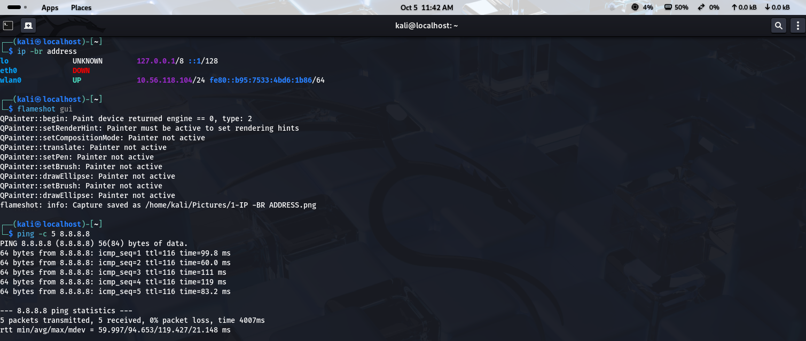
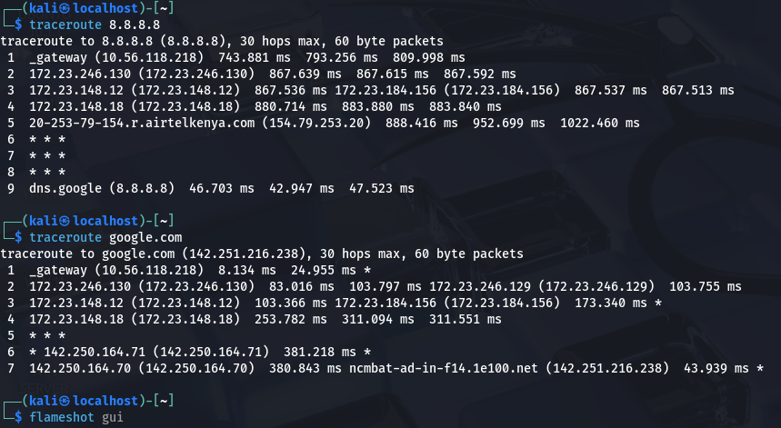

## Objective 
My objective of the lab is that to practise the basics of network troubleshooting using kali linux, I need to understand how i can test connectivity, check the IP configuration, investigate the DNS resolution and inspect the route to a destination
## Lab Environment 
My operatinng system is kali linux and my internet connection is mobile-hotspot the tools that I will use are IP, Ping and traceroute and the test destination will be google public DNS server 8.8.8.8
## Test 1 Inspecting the network interfaces
Inspect the network the network interfaces and the command: IP-br address, this command displays network interfaces and their  IP  address assigned in a format, so what i will be looking for is which network interfaces are available, which network interface is active and if the interface has an IP address, my observation as per the screenshot shows as follows
## Test 2 Test IP connectivity 
The command being ping -c 5 8.8.8.8 the purpose is that this sends 5 icmp echo requests to 8.8.8.8 and it checks the replies arrival, what iam looking for is whether the replies are received, the round trip  time in ms and the packet loss percentage. My observation from the from the screenshot i sent 5 ICMP Echo requests to 8.8.8.8 and all received replies resulting in 0 percent packet loss and the average round trip was 94.7ms
### Screenshot

[Ping test to Google](Screenshots/Ping%20-8.8.8.8.png)
## Test 3 Test the DNS resolution 
The command is: ping -c 5 google.com the purpose is to test whether kali can resolve the domain name and whether the destination responds to a ping request: I  will be  looking whether the destination responds to an IP address, whether the domain resolves to an IP address whether the replies arrive or whether there is an occurrence of packet loss. My observation is that a failed ping does not automatically prove that the DNS is broken because the destination or the network may filter the ICMP 
Test 4 Trace the Network path:
the commands being 8.8.8.8, the trace route being google .com, the purpose of traceroute path is that it helps to reveal the network hops that respond to the probes that are travelling to the destinations. The earlier results showed that private IP addresses at many hops, a hop associated with an airtel kenya hstname, and a successful response from 8.8.8.8 while some intermediate hops displays *****
## My Analysis 
From the traceroute results i have learnt that traffic can pass through several route before reaching a destination, private IP addresses may appear the internal or provider networks, some routes may not respond to the diagnostics probes and a missing response at one hop does not mean that traffic cant continue the traceroute output can vary between tests
## For Security and Privacy 
Before I publish any of my screenshots of my terminal i will hide or reduce the details that are unecessary for explaining the lab such as the public IP address, MAC address, private network details, my usernmes and other sensitive information and i will only troubleshoot or scan systems and networks that i own or have permission to test
## What I have Learnt 
Network troubleshooting will work best when testing one layer or possibility at a time e.g checking the IP configuration testing the IP connectivity, checking DNS resolution and tracing the network path,  they provide different pieces of evidence and one should interpret or read the results carefully rather than assume that an attempt failed proved the network has issues  
### Screenshot

### Screenshot

